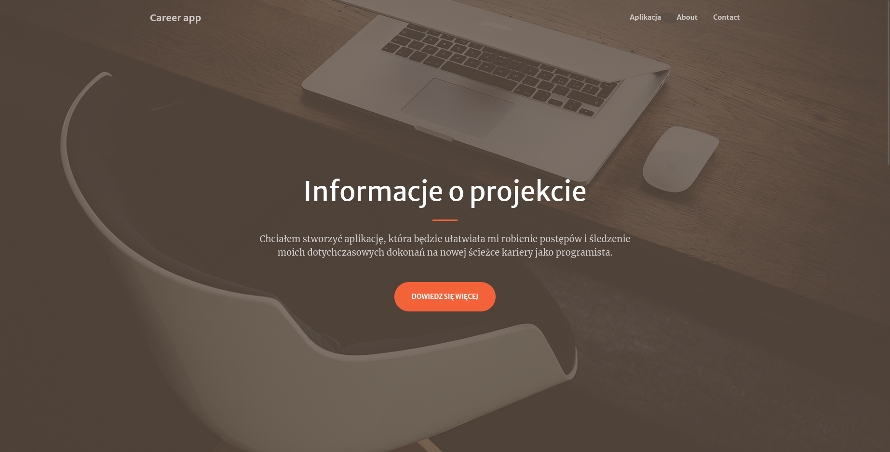
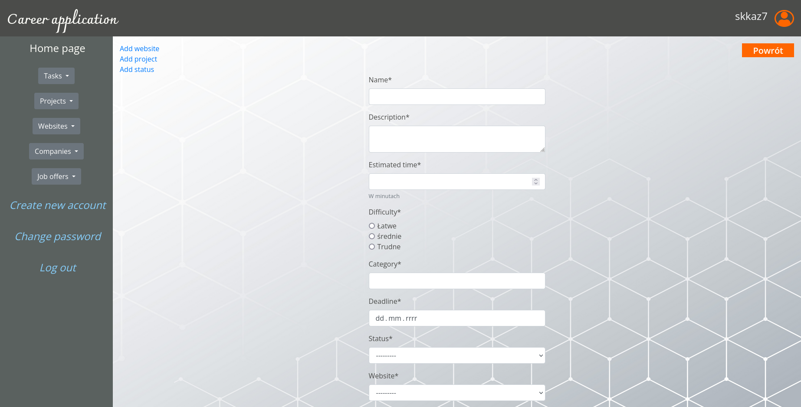
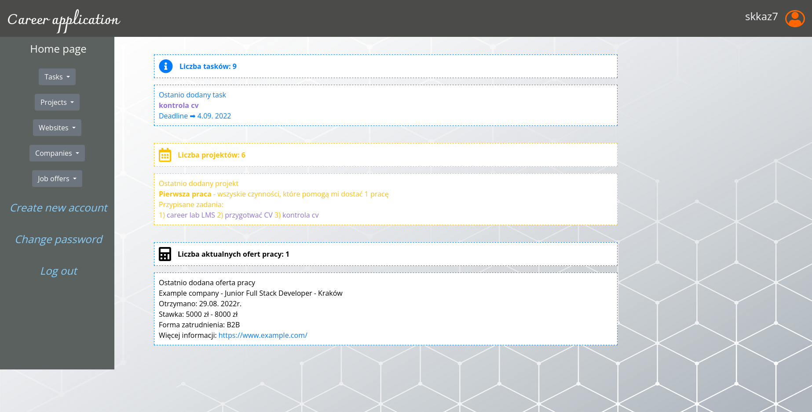

# career-app
> ### I wanted to create an app that would make it easy to make progress and track achievements so far on a new career path.
> Live demo [_here_](https://www.example.com). <!-- If you have the project hosted somewhere, include the link here. -->

## Table of Contents
* [General Info](#general-information)
* [Technologies Used](#technologies-used)
* [Features](#features)
* [Screenshots](#screenshots)
* [Setup](#setup)
* [Project Status](#project-status)
* [Room for Improvement](#room-for-improvement)
* [Acknowledgements](#acknowledgements)
* [Contact](#contact)
<!-- * [License](#license) -->

## General Information
The project was created as a final project at the end of the Python Developer course at the IT Coders Lab school. 
This is my first independent project and I wanted the created application to help me make progress on my new career path.
<!-- You don't have to answer all the questions - just the ones relevant to your project. -->

## Technologies Used
- Python - version 3.10.6
- Django - version 4.1.2
- bootstrap - version 5.2.0
- pytest - version 7.1.3
- pytest-django - version 4.5.2
- SQLite - version 3.39.4

## Features
List the ready features here:
- adding, editing and deleting tasks
- assigning tasks to specific projects
- comparing incoming job offers
- user profile
  - login
  - registration
  - password change
- unit tests for every view in application using fixtures
- django generic views
- controlling permissions, authorisation and limiting access to views using  mixins

## Screenshots

<!-- If you have screenshots you'd like to share, include them here. -->

## Setup
Requirements/dependencies are listed in a requirements.txt file which is located in the project's main directory.

## Project Status
Project is: _in progress_

## Room for Improvement
Room for improvement:
- the visual side of the project
- facilitating the addition of new tasks

To do:
- adding new tests
- adding some js

## Acknowledgements
Give credit here.
- The project is my own initiative. It was inspired by the need to keep track of my learning progress.
- Many thanks to my mentor and my course colleagues!

## Contact
Created by [@skkaz7](https://www.linkedin.com/in/sebastian-kazmierczak) - feel free to contact me!

<!-- Optional -->
<!-- ## License -->
<!-- This project is open source and available under the [... License](). -->

<!-- You don't have to include all sections - just the one's relevant to your project -->
